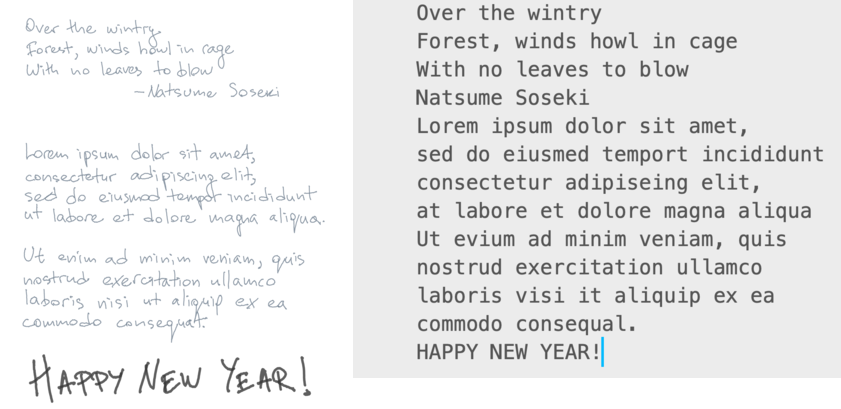

# Remarkable tablet sync and page OCR
A quick hack for syncing notebooks off the Remarkable (direct USB transfer), converting them to PDF form, and running OCR on the pages. Attempts to only convert changed pages. Uses AWS textract for OCR.

Loosely tested on Linux and OSX(intel).

I admit this is not entirely end-user-friendly. If you know your way around a Unix shell, you should be ok.

I wrote this in an evening and don't have the time to support it properly.
If you like it, help me make it better.

# Requirements
* `[brew/apt/dnf] install imagemagick jq awscli`
* `pip install boto3 pypdf2`
* [rm2pdf][1] built and installed in your path

[1]: https://github.com/rorycl/rm2pdf.git "rm2pdf @ github"

# Setup
* `aws configure` [this may help][2] (also look at [pricing][4] for OCR)
* [Set up ssh and rsync on your tablet][3]
    - Example `.ssh/config` section:
    ```
    Host rm
    User root
    ControlMaster no
    ControlPath none
    Hostname 10.11.99.1
    ```
* SSH to the tablet and find the hashes of the notebooks you want to sync
    -  `ssh root@10.11.99.1`
    -  `ln -s ~/.local/share/remarkable/xochitl ~/content` <- for convenience
    -  `cd content`
    -  `grep [notebook_name] *.metadata|cut -f1 -d '.'` <- start here, then look at the metadata file to confirm
* Back on the mainland, add the notebook hashes to `notebooks.conf`, one per line
* Check the config variables at top of `rmocrsync.sh`

[2]: https://docs.aws.amazon.com/cli/latest/userguide/cli-configure-quickstart.html#cli-configure-quickstart-config "AWS CLI Setup"

[3]: https://github.com/lucasrla/remarkable-utils "Remarkable Utils"

[4]: https://aws.amazon.com/textract/pricing/ "AWS Textract Pricing"

# Usage
From the repo folder, update the notebook list per the above instructions and try running `./rmocrsync.sh` It _should_ work out of the box. 

If it completes successfully, take a look in the `notebooks` folder. You should have a PDF of your notebook, a folder of OCR text files (one file per page), and an annotated PDF that embeds the text in each page. 

# Demo

## OCR Example
